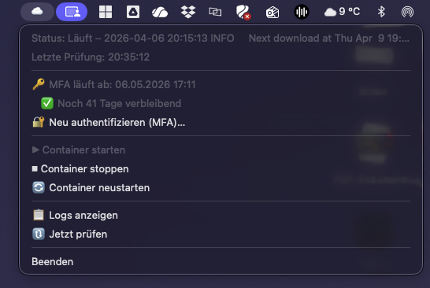

# icloudpd Monitor

A macOS menu bar app for monitoring and controlling the [icloudpd](https://github.com/boredazfcuk/docker-icloudpd) Docker container on an Unraid server.


## Screenshot



## Features

| Feature | Description |
|---------|-------------|
| **Status Display** | ☁️ Running · ⛅ Stopped · 🌧 Error · ⚠️ MFA Warning |
| **Container Control** | Start, stop, restart via menu |
| **MFA Monitoring** | Shows expiration date and remaining days of the 2FA session |
| **MFA Renewal** | Enter a 6-digit code directly through the app |
| **Logs** | Fetch recent log lines and view them in TextEdit |
| **Auto-Polling** | Status updates every 30 seconds |
| **Autostart** | Launches automatically on login via LaunchAgent |

## Prerequisites

### macOS

- macOS 13 (Ventura) or later
- Python 3.9+ (included with Xcode Command Line Tools)

### Server (Unraid)

- [boredazfcuk/docker-icloudpd](https://github.com/boredazfcuk/docker-icloudpd) container running
- SSH access to the server (root or a user with Docker permissions)
- Container configured with `authentication_type=2FA`

## Installation

### 1. Clone the repository

```bash
git clone https://github.com/tommigraef/icloudpd-Monitor.git
cd icloudpd-Monitor
```

### 2. Install Python dependencies

The app requires a Python virtual environment with the following packages:

```bash
python3 -m venv .venv
source .venv/bin/activate
pip install -r requirements.txt
```

#### Dependencies

| Package | Version | Purpose |
|---------|---------|---------|
| [rumps](https://github.com/jaredks/rumps) | ≥ 0.4.0 | macOS menu bar framework (based on PyObjC) |
| [paramiko](https://www.paramiko.org/) | ≥ 3.0.0 | SSH connection to the Unraid server |

These automatically pull in the following sub-dependencies:

- **pyobjc-core** / **pyobjc-framework-Cocoa** – Python bindings for macOS AppKit/Foundation
- **PyObjCTools** – Helper utilities (including `AppHelper.callAfter` for thread-safe UI updates)
- **cryptography** / **bcrypt** / **pynacl** / **cffi** – SSH cryptography (Paramiko)

### 3. Configuration

```bash
cp config.example.py config.py
```

Edit `config.py` with your server details:

```python
SSH_HOST = "192.168.1.25"        # IP of your Unraid server
SSH_PORT = 22
SSH_USER = "root"
SSH_PASSWORD = "your_password"   # Or use SSH keys

CONTAINER_NAME = "icloudpd"
CONFIG_PATH = "/mnt/user/appdata/icloudpd"
COOKIE_FILE = "youremailaddress"  # Apple ID without special characters
```

> **Note:** `COOKIE_FILE` is your Apple ID with all special characters removed.
> Example: `john.doe@gmail.com` → `johndoegmailcom`

### 4. Run the app

#### Option A: Directly from the terminal

```bash
source .venv/bin/activate
python3 app.py
```

Or using the quick-start script:

```bash
./run.sh
```

#### Option B: As a native macOS app (recommended)

Builds a standalone `.app` bundle and installs it to `/Applications`:

```bash
source .venv/bin/activate
pip install py2app
./build.sh
```

The app will be located at `/Applications/icloudpd Monitor.app`.

### 5. Set up autostart

Create a LaunchAgent so the app starts automatically on every login:

```bash
cat > ~/Library/LaunchAgents/com.tommi.icloudpd-monitor.plist << 'EOF'
<?xml version="1.0" encoding="UTF-8"?>
<!DOCTYPE plist PUBLIC "-//Apple//DTD PLIST 1.0//EN" "http://www.apple.com/DTDs/PropertyList-1.0.dtd">
<plist version="1.0">
<dict>
    <key>Label</key>
    <string>com.tommi.icloudpd-monitor</string>
    <key>ProgramArguments</key>
    <array>
        <string>/usr/bin/open</string>
        <string>-a</string>
        <string>/Applications/icloudpd Monitor.app</string>
    </array>
    <key>RunAtLoad</key>
    <true/>
    <key>KeepAlive</key>
    <false/>
    <key>StandardOutPath</key>
    <string>/tmp/icloudpd-monitor.log</string>
    <key>StandardErrorPath</key>
    <string>/tmp/icloudpd-monitor.err</string>
</dict>
</plist>
EOF
```

Activate:

```bash
launchctl load ~/Library/LaunchAgents/com.tommi.icloudpd-monitor.plist
```

### Useful Commands

| Action | Command |
|--------|---------|
| Start app | `open -a "icloudpd Monitor"` |
| Stop app | `pkill -f "icloudpd Monitor"` |
| Disable autostart | `launchctl unload ~/Library/LaunchAgents/com.tommi.icloudpd-monitor.plist` |
| Enable autostart | `launchctl load ~/Library/LaunchAgents/com.tommi.icloudpd-monitor.plist` |
| Check logs | `cat /tmp/icloudpd-monitor.err` |
| Rebuild + install | `cd ~/Projects/icloudpd-Monitor && source .venv/bin/activate && ./build.sh` |

## Project Structure

```
icloudpd-Monitor/
├── app.py              # Main application (rumps + paramiko)
├── config.example.py   # Configuration template
├── config.py           # Your configuration (git-ignored)
├── requirements.txt    # Python dependencies
├── run.sh              # Quick-start script
├── build.sh            # Builds .app bundle and installs to /Applications
└── .gitignore
```

## Troubleshooting

### App crashes immediately
Check `/tmp/icloudpd-monitor.err` for error messages. Common cause: `config.py` is missing or SSH credentials are incorrect.

### SSH connection fails
- Is the server reachable? `ping 192.168.1.XXX`
- Is the SSH port open? `nc -zv 192.168.1.XXX 22`
- Are the credentials correct? `ssh root@192.168.1.XXX`

### MFA renewal fails
- The container must be running
- The code must be 6 digits
- If issues persist: check container logs via the app

## License

MIT
